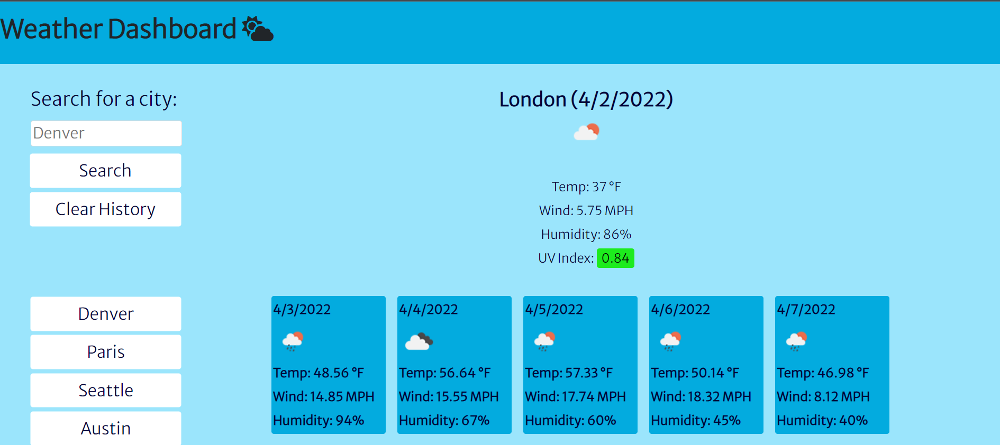

# Weather-Dashboard

  

     
    <h2 align="center"><a href="https://github.com/cdfoye/Weather-Dashboard"><strong>Link to the GitHub Repo »</strong></a></h2>
     
    <h2 align="center"><a href="https://cdfoye.github.io/Weather-Dashboard/">Link to the Weather Dashboard »</strong></a></h2>
     
     
  

<!-- PROJECT DESCRIPTION -->
<h1 align="center"> Project Description</h1>

This project allows a traveler to see the weather outlook for multiple cities in order to plan a trip. When they search for a city, they are presented with the current and future 5 day forecast for the city, and that city is then added to the search history. When they click on a city in the search history, then the user is presented with the current and future 5 day forecast again.

 
 

<!-- ABOUT THE PROJECT -->
<h1 align="center"> About The Project</h1>

The following is an image mockup of the weather dashboard appearance and functionality:

 

